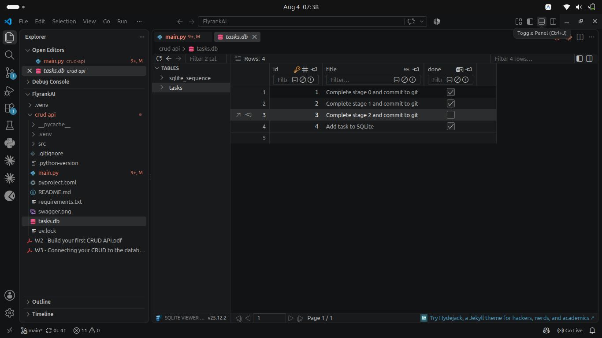
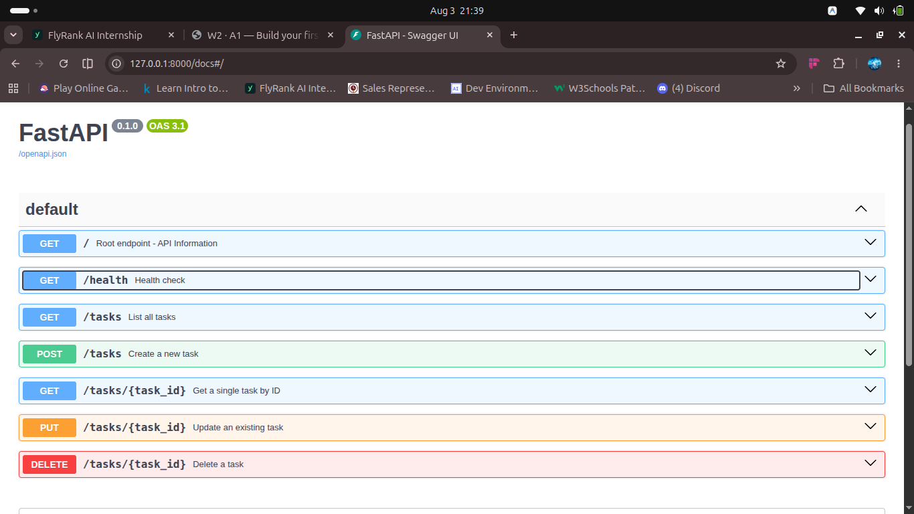

# Task API with SQLite Database

A lightweight RESTful CRUD API for managing to-do tasks, built with Python, FastAPI, Pydantic, and SQLite for permanent data persistence.

## Database Overview

This API uses **SQLite** (`tasks.db`) for storing tasks persistently on disk across server restarts.

### Why SQLite?
- **Zero Configuration:** No external database server (like PostgreSQL or MySQL) is required to install or manage.
- **Single File Persistence:** The entire database lives in a local file (`tasks.db`), making it portable and easy to inspect.
- **Built into Python:** Uses Python's standard `sqlite3` module without external database drivers.

### Schema Design (`tasks` table)

| Column | Type | Constraints | Description |
|---|---|---|---|
| `id` | `INTEGER` | `PRIMARY KEY AUTOINCREMENT` | Unique auto-incrementing identifier |
| `title` | `TEXT` | `NOT NULL` | Description of the task |
| `done` | `BOOLEAN` | `NOT NULL DEFAULT 0` | Completion status (`0` = false, `1` = true) |

### Example SQL Queries

```sql
-- Read all tasks
SELECT * FROM tasks;

-- Read all completed tasks
SELECT * FROM tasks WHERE done = 1;

-- Insert a new task
INSERT INTO tasks (title, done) VALUES ('Learn SQLite', 0);

-- Update task status
UPDATE tasks SET done = 1 WHERE id = 4;

-- Delete a task
DELETE FROM tasks WHERE id = 4;
```

---

## Database Viewer

Tasks table inspected via the SQLite Viewer:



---

## How to run it

1. **Clone this repo**
   ```bash
   git clone https://github.com/hafsat-abdulhamid/crud-api.git
   cd crud-api
   ```

2. **Create virtual environment**
   ```bash
   python3 -m venv .venv
   ```

3. **Activate virtual environment**
   ```bash
   source .venv/bin/activate
   ```

4. **Install dependencies**
   ```bash
   pip install -r requirements.txt
   ```

5. **Start the server**
   ```bash
   uvicorn main:app --reload
   ```
   The API will be running at `http://localhost:8000`.

---

## Endpoints

| Method | Path | Description | Status codes |
|---|---|---|---|
| `GET` | `/` | API info | `200` |
| `GET` | `/health` | Health check | `200` |
| `GET` | `/tasks` | List all tasks from SQLite | `200` |
| `GET` | `/tasks/{id}` | Get one task by ID from SQLite | `200`, `404` |
| `POST` | `/tasks` | Create a task in SQLite | `201`, `400` |
| `PUT` | `/tasks/{id}` | Update a task in SQLite | `200`, `400`, `404` |
| `DELETE` | `/tasks/{id}` | Delete a task from SQLite | `204`, `404` |

---

## Example curl output

```bash
$ curl -i -X POST http://localhost:8000/tasks -H "Content-Type: application/json" -d '{"title":"Add task to SQLite"}'

HTTP/1.1 201 Created
date: Tue, 04 Aug 2026 06:29:44 GMT
server: uvicorn
content-length: 49
content-type: application/json

{"id":4,"title":"Add task to SQLite","done":false}
```

---

## Swagger UI

Interactive OpenAPI documentation is available at `http://localhost:8000/docs` while the server is running:


