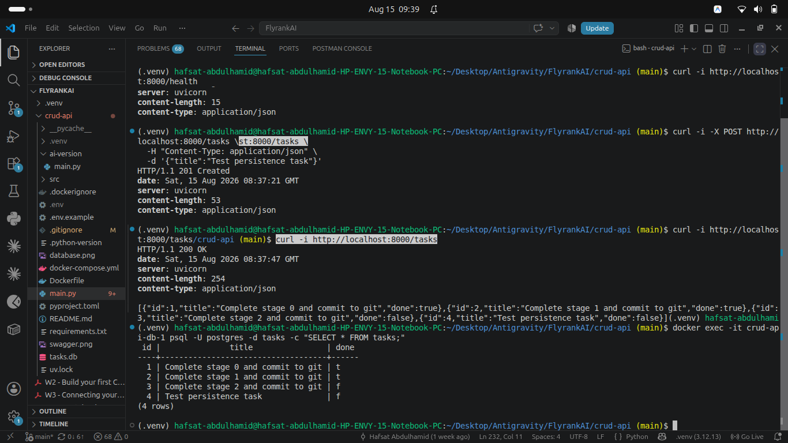

# Task API — Containerized PostgreSQL CRUD Service

A production-grade RESTful Task Management API built with **FastAPI**, **PostgreSQL**, and **Docker Compose**. This service provides full CRUD functionality, statistics computation, dynamic search, filtering, and sorting, backed by a persistent relational database engine.



---

## 🚀 Features

- **Full CRUD Endpoints**: Create (`POST`), Read (`GET`), Update (`PUT`), and Delete (`DELETE`) tasks.
- **Search, Filter & Sort (`GET /tasks`)**: Supports substring searching (`search`), completion state filtering (`done`), and custom sorting (`sort=title`).
- **Aggregation Metrics (`GET /stats`)**: Computes live task statistics (`total_tasks`, `completed_tasks`, `pending_tasks`).
- **PostgreSQL Persistence**: Data persists across container restarts using a managed Docker Volume (`taskdata`).
- **Docker Compose Orchestration**: Single-command stack bring-up featuring PostgreSQL healthcheck dependency ordering (`pg_isready`).
- **Interactive Swagger Documentation**: Auto-generated interactive OpenAPI docs available at `/docs`.

---

## 🛠️ Tech Stack & Dependencies

- **Language**: Python 3.10+
- **Web Framework**: [FastAPI](https://fastapi.tiangolo.com/)
- **ASGI Server**: [Uvicorn](https://www.uvicorn.org/)
- **Database Engine**: [PostgreSQL 15](https://www.postgresql.org/)
- **Database Driver**: [psycopg2](https://www.psycopg.org/) (`RealDictCursor`)
- **Containerization**: Docker & Docker Compose
- **Schema Validation**: [Pydantic v2](https://docs.pydantic.dev/)

---

## 📦 Environment Variable Setup

Sensitive database credentials and connection strings are managed via `.env`.

> **CRITICAL SECURITY NOTE**: The `.env` file is excluded from Git version control via `.gitignore`. Never commit database passwords or production connection strings to version control.

### Setup Instructions:

1. Copy `.env.example` to `.env`:
   ```bash
   cp .env.example .env
   ```
2. Inspect or update `.env`:
   ```env
   DATABASE_URL=postgresql://taskuser:taskpassword@db:5432/taskdb
   ```

---

## ⚙️ Quickstart (Single Command)

Clone the repository and launch the full containerized stack using Docker Compose:

```bash
# 1. Clone the repository
git clone https://github.com/Mirah-003/crud-api.git
cd crud-api

# 2. Set up environment configuration
cp .env.example .env

# 3. Launch containerized stack
docker compose up --build
```

- **API Base URL**: `http://localhost:8000`
- **Interactive Swagger UI**: [http://localhost:8000/docs](http://localhost:8000/docs)

To stop the containerized services:
```bash
docker compose down
```

---

## 📖 API Reference Table

| Method | Endpoint | Description | Query Parameters | Expected Status |
| :--- | :--- | :--- | :--- | :---: |
| `GET` | `/` | API Root & Metadata | None | `200 OK` |
| `GET` | `/health` | Application Health Check | None | `200 OK` |
| `GET` | `/stats` | Task Aggregation Statistics | None | `200 OK` |
| `GET` | `/tasks` | List Tasks with Filtering | `search`, `done`, `sort` | `200 OK` |
| `GET` | `/tasks/{id}` | Read Single Task by ID | Path: `id` (integer) | `200 OK` / `404 Not Found` |
| `POST` | `/tasks` | Create New Task | Body: `{"title": "..."}` | `201 Created` / `400 Bad Request` |
| `PUT` | `/tasks/{id}` | Update Task Title/Done State | Body: `{"title": "...", "done": true}` | `200 OK` / `404 Not Found` |
| `DELETE` | `/tasks/{id}` | Delete Task | Path: `id` (integer) | `204 No Content` / `404 Not Found` |

---

## 🧠 Architectural Insight: Storage as an Implementation Detail

Across Assignments A1, A2, and A3, the core FastAPI HTTP application contract (`/tasks`) remained completely invariant:
1. **Assignment A1**: In-memory Python lists
2. **Assignment A2**: Local SQLite database file (`tasks.db`)
3. **Assignment A3**: Containerized PostgreSQL relational engine

Because HTTP route signatures and Pydantic schemas remained fixed, client applications consuming this API required zero code changes when we migrated storage providers. This proves that **storage is merely an implementation detail behind an interface boundary**.